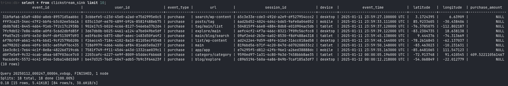

**E2E Real-Time Data Pipeline with Kafka, Flink, Iceberg, Trino, MinIO, and Superset**
======================================================================================


**📖 Overview**
---------------

This project demonstrates a **real-time end-to-end (E2E) data pipeline** designed to handle clickstream data. It shows how to ingest, process, store, query, and visualize streaming data using open-source tools, all containerized with Docker for easy deployment.

🔎 **Technologies Used:**

-   **Data Ingestion:** [Apache Kafka](https://kafka.apache.org/)  
-   **Stream Processing:** [Apache Flink](https://flink.apache.org/)  
-   **Object Storage:** [MinIO (S3-compatible)](https://min.io/)
-   **Data Lake Table Format:** [Apache Iceberg](https://iceberg.apache.org/)  
-   **Query Engine:** [Trino](https://trino.io/)  
-   **Visualization:** [Apache Superset](https://superset.apache.org/)    


This pipeline is perfect for **data engineers** and **students** interested in learning how to design real-time data systems.

* * * * *

**🏗  Architecture**
-----------------------------------


1.  **Clickstream Data Generator** simulates real-time user events and pushes them to **Kafka** topic.
2.  **Apache Flink** processes Kafka streams and writes clean data to **Iceberg tables** stored on **MinIO**.
3.  **Trino** connects to Iceberg for querying the processed data.
4.  **Apache Superset** visualizes the data by connecting to Trino.


🛠 **Tech Stack**
-----------------

| **Component**       | **Technology**                                                                 | **Purpose**                                     |
|--------------------|-------------------------------------------------------------------------------|-------------------------------------------------|
| **Data Generator**  | [Python (Faker)](https://faker.readthedocs.io/)                              | Simulate clickstream events                      |
| **Data Ingestion**  | [Apache Kafka](https://kafka.apache.org/)                                    | Real-time event streaming                        |
| **Coordination Service** | [Apache ZooKeeper](https://zookeeper.apache.org/) | Kafka broker coordination and metadata management |
| **Stream Processing** | [Apache Flink](https://flink.apache.org/)                                  | Real-time data processing and transformation     |
| **Data Lake Storage** | [Apache Iceberg](https://iceberg.apache.org/)                               | Data storage and schema management              |
| **Object Storage**  | [MinIO](https://min.io/)                                                      | S3-compatible storage for Iceberg tables         |
| **Query Engine**    | [Trino](https://trino.io/)                                                    | Distributed SQL querying on Iceberg data         |
| **Visualization**   | [Apache Superset](https://superset.apache.org/)                               | Interactive dashboards and data visualization    |

* * * * *


**📦 Project Structure**
------------------------

```bash
e2e-data-pipeline/
├── docker-compose.yml   # Docker setup for all services
├── flink/               # Flink SQL client and streaming jobs
├── producer/            # Clickstream data producer using Faker
├── superset/            # Superset setup and configuration
└── trino/               # Trino configuration for Iceberg 
```

* * * * *

**🔧 Setup Instructions**
-------------------------

### **1\. Prerequisites**

-   **Docker** and **Docker Compose** installed.
-   Minimum **16GB RAM** recommended.

### **2\. Clone the Repository**

```bash
git clone https://github.com/abeltavares/real-time-data-pipeline.git
cd real-time-data-pipeline
```

### **3\. Start All Services**

```bash
docker-compose up -d
```

⚠️ **Note:** All components (Kafka, Flink, Iceberg, Trino, MinIO, and Superset) are containerized using Docker for easy deployment and scalabilit

### **4\. Access the Services**

| **Service** | **URL** | **Credentials** |
| --- | --- | --- |
| **Kafka Control Center** | `http://localhost:9021` | *No Auth* |
| **Flink Dashboard** | `http://localhost:18081` | *No Auth* |
| **MinIO Console** | `http://localhost:9001` | `admin` / `password` |
| **Trino UI** | `http://localhost:8080/ui` | *No Auth* |
| **Superset** | `http://localhost:8088` | `admin` / `admin` |


📥 **Data Ingestion**
---------------------

### 1\. **Clickstream Data Generation**

Clickstream events are simulated using Python's **Faker** library. Here's the event structure:

```python
{
  "event_id": fake.uuid4(),
  "user_id": fake.uuid4(),
  "event_type": fake.random_element(elements=("page_view",        "add_to_cart", "purchase", "logout")),
  "url": fake.uri_path(),
  "session_id": fake.uuid4(),
  "device": fake.random_element(elements=("mobile", "desktop", "tablet")),
  "timestamp": time.strftime("%Y-%m-%dT%H:%M:%SZ", time.gmtime()),
  "geo_location": {
      "lat": float(fake.latitude()),
      "lon": float(fake.longitude())
  },
  "purchase_amount": float(random.uniform(0.0, 500.0)) if fake.boolean(chance_of_getting_true=30) else None
}
```

⚠️ **Note:** The **Clickstream Producer** runs automatically when Docker Compose is up. No manual execution is needed.

### 2\. **Kafka Consumer**

The Kafka consumer reads the clickstream events and pushes them to **Apache Flink** for real-time processing.

You can monitor the Kafka topic through the **Kafka Control Center**:

-   **Kafka Control Center URL:** <http://localhost:9021>


* * * * *

⚡ **Real-Time Data Processing with Apache Flink**
-------------------------------------------------

### 1\. **Flink Configuration**

-   **State Backend:** RocksDB
-   **Checkpointing:** Enabled for fault tolerance
-   **Connectors:** Kafka → Iceberg (via Flink SQL)

### 2\. **Flink SQL Job Execution**

The `sql-client` service in Docker Compose automatically submits the Flink SQL job after the JobManager and TaskManager are running. It uses the `clickstream-filtering.sql` script to process Kafka streams and write to Iceberg.

```bash
/opt/flink/bin/sql-client.sh -f /opt/flink/clickstream-filtering.sql
```

### 2\. **Flink Dashboard**

Monitor real-time data processing jobs at:\
📊 http://localhost:18081


* * * * *

🗄️ **Data Lakehouse with Apache Iceberg**
------------------------------------------

Processed data from Flink is stored in **Iceberg tables** on **MinIO**. This enables:

-   **Efficient Querying** with Trino
-   **Schema Evolution** and **Time Travel**

To list the contents of the MinIO warehouse, you can use the following command:

```bash
docker exec mc bash -c "mc ls -r minio/warehouse/"
```

Alternatively, you can access the MinIO console via the web at <http://localhost:9001>.

-   **Username:** `admin`
-   **Password:** `password`


**🔍 Query Data with Trino**
----------------------------

 **1\. Run Trino CLI**

```bash
docker-compose exec trino trino
```

**2\. Connect to Iceberg Catalog**

```sql
USE iceberg.db;
```

**3\. Query Processed Data**

```sql
SELECT * FROM iceberg.db.clickstream_sink
WHERE purchase_amount > 100
LIMIT 10;
```



📊 **Data Visualization with Apache Superset**
----------------------------------------------

1.  **Access Superset:** <http://localhost:8088>

    -   **Username:** `admin`
    -   **Password:** `admin`
2.  **Connect Superset to Trino:**

-   **SQLAlchemy URI:**

    ```bash
    trino://trino@trino:8080/iceberg/db
    ```
-   **Configure in Superset:**

    1.  Open `http://localhost:8088`
    2.  Go to **Data** → **Databases** → **+**
    3.  Use the above SQLAlchemy URI.

3.  **Create Dashboards:**


🏆 **Key Features**
-------------------

### 🔄 **Real-Time Data Processing**

-   Stream processing with **Apache Flink**.
-   Clickstream events are transformed and filtered in real-time.

### 📂 **Modern Data Lakehouse**

-   Data is stored in **Apache Iceberg** on **MinIO**, S3 compatible, supporting schema evolution and time travel.

### ⚡ **Fast SQL Analytics**

-   **Trino** provides fast, distributed SQL queries on Iceberg data.

### 📊 **Interactive Dashboards**

-   **Apache Superset** delivers real-time visual analytics.

### 📦 **Fully Containerized Setup**

-   Simplified deployment using **Docker** and **Docker Compose** for seamless integration across all services.

* * * * *

📈 **Future Enhancements**
--------------------------

-   Implement **alerting** and **monitoring** with **Grafana** and **Prometheus**.
-   Introduce **machine learning pipelines** for predictive analytics.
-   Optimize **Iceberg partitioning** for faster queries.

* * * * *

📎 **Quick Reference Commands**
-------------------------------

| **Component** | **Command** |
| --- | --- |
| **Start Services** | `docker-compose up --build -d` |
| **Stop Services** | `docker-compose down` |
| **View Running Containers** | `docker ps` |
| **Check Logs** | `docker-compose logs -f` |
| **Rebuild Containers** | `docker-compose up --build --force-recreate -d` |

* * * * *

🙌 **Get Involved**
-------------------

Contributions are welcome! Feel free to submit issues or pull requests to improve this project.

* * * * *

📜 License
--------------

This project is licensed under the [MIT License](LICENSE).

* * * * *

Enjoy exploring real-time data pipelines!